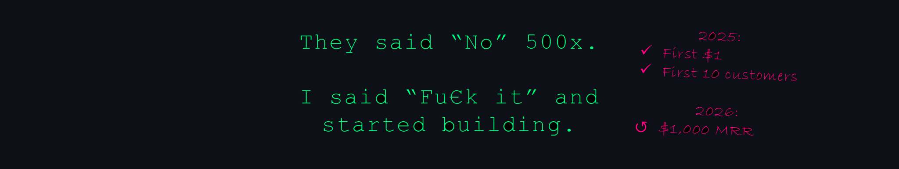

Hi, I'm Rok! 

I wrote my first line of HTML in 2017 during a 2-hour high school class. Not knowing that you can make a simple website with a single HTML file, I was blown away! I rushed home and started coding every day, making sites with cheap animations and proudly showing them to my family even though I couldn’t tell Java from JavaScript. 👀

Fast-forward a few years. I got a master’s in economics, but I kept coding. In 2022, I made my first API call to OpenAI’s GPT-3, which was SOTA at the time. Damn! I jumped into the AI rabbit hole like Neo before the red pill even hit his tongue. 💊

From 2022 to 2024, I lived on Stack Overflow, helping developers implement the OpenAI API. I became the #1 OpenAI API contributor on Stack Overflow. Hundreds of answers written, thousands of reputation points gained, and ∞ hours spent, but that didn't help me land a job. In 2024 I applied for ≈500 jobs. I finally got one as an AI engineer after 12 months of searching. Guess what? I was fired after 1.5 months! That broke me but woke me. I dropped community contributions to 0 overnight. No more chasing reputation points. You can't pay the rent with that. 💰

In 2025, I stepped on a path of becoming a solopreneur, building apps with AI in public. Prior to that, I never shipped ANYTHING in production! Not a single landing page was deployed. Nothing was ever good enough. The term "MVP" was not in my vocabulary. 😬

Now I'm all in. Like, kicking a$$ 24/7. I’m not [insert your favorite indie developer]. Yet! But I started launching apps. The identity shift from “community contributor” to “solopreneur” was brutal. It’s not easy to lose a crown, whatever the title you got the crown for. But fu€k it! I’d rather wear a battle-worn one than a shiny one that got me nowhere. 🔥

If you’re into raw progress over polished bull$hit, connect with me on [LinkedIn](https://www.linkedin.com/in/rokbenko) or follow me on [X](https://www.x.com/intent/follow?screen_name=rokbenko), where I share my journey. 🚀

Startups:

- 🎙️ [PodcastPrepper](https://www.podcast-prepper.com/) (March 2025): Reduces podcast guest preparation effort by 95%+
- 🚀 [AutoLaunched](https://www.autolaunched.com/) (August 2025): Launches a startup 10x cheaper and 1,000x faster
- 🤑 [r/KaChing](https://www.rkaching.com/) (August 2025): Generates startup ideas that people actually need

Milestones:

- April 3, 2025: My first $1 online earned with SaaS! 🎉
- July 6, 2025: My first custom app sale for $3,000! 🎉
